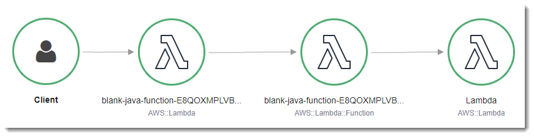
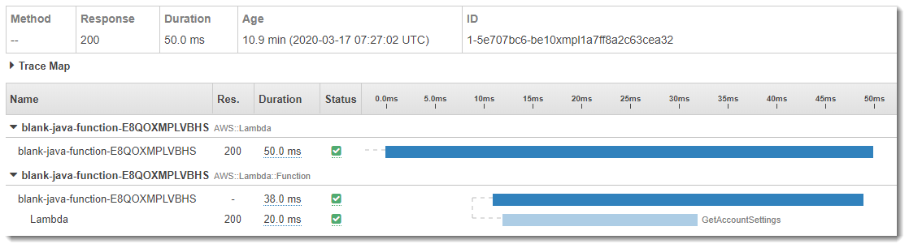
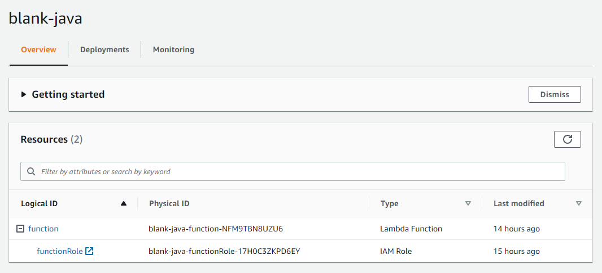

# aws-lambda-authentication-java

This project is to demo how to create a Lambda function in Java which performs user authentication using oAuth Authorization Code grant type through AWS Cognito. The details, such as workflows and sequence diagrams can be found at [User authentication through authorization code grant type using AWS Cognito](https://dev.to/jinlianwang/user-authentication-through-authorization-code-grant-type-using-aws-cognito-1f93).

It is built upon AWS Lambda sample code - [blank-java](https://github.com/awsdocs/aws-lambda-developer-guide/tree/main/sample-apps/blank-java), that showcases the use of Lambda's Java libraries, logging, environment variables, layers, AWS X-Ray tracing, unit tests, and the AWS SDK. The project source includes function code and supporting resources:

- `src/main` - A Java function.
- `src/test` - A unit test and helper classes.
- `template.yml` - An AWS CloudFormation template that creates an application.
- `build.gradle` - A Gradle build file.
- `pom.xml` - A Maven build file.
- `1-create-bucket.sh`, `2-build-layer.sh`, etc. - Shell scripts that use the AWS CLI to deploy and manage the application.

Use the following instructions to deploy the sample application.

# Requirements
- [Java 8 runtime environment (SE JRE)](https://www.oracle.com/java/technologies/javase-downloads.html)
- [Gradle 5](https://gradle.org/releases/) or [Maven 3](https://maven.apache.org/docs/history.html)
- The Bash shell. For Linux and macOS, this is included by default. In Windows 10, you can install the [Windows Subsystem for Linux](https://docs.microsoft.com/en-us/windows/wsl/install-win10) to get a Windows-integrated version of Ubuntu and Bash.
- [The AWS CLI](https://docs.aws.amazon.com/cli/latest/userguide/cli-chap-install.html) v1.17 or newer.

If you use the AWS CLI v2, add the following to your [configuration file](https://docs.aws.amazon.com/cli/latest/userguide/cli-configure-files.html) (`~/.aws/config`):

```
cli_binary_format=raw-in-base64-out
```

This setting enables the AWS CLI v2 to load JSON events from a file, matching the v1 behavior.

# Setup
Download or clone this repository.

    $ git clone https://github.com/JinlianWang/aws-lambda-authentication-java.git
    $ cd aws-lambda-authentication-java/

To create a new bucket for deployment artifacts, run `1-create-bucket.sh`.

    aws-lambda-authentication-java$ ./1-create-bucket.sh
    make_bucket: lambda-artifacts-a5e491dbb5b22e0d

To build a Lambda layer that contains the function's runtime dependencies, run `2-build-layer.sh`. Packaging dependencies in a layer reduces the size of the deployment package that you upload when you modify your code.

    aws-lambda-authentication-java$ ./2-build-layer.sh

# Deploy

To deploy the application, run `3-deploy.sh`.

    aws-lambda-authentication-java$ ./3-deploy.sh
    BUILD SUCCESSFUL in 1s
    Successfully packaged artifacts and wrote output template to file out.yml.
    Waiting for changeset to be created..
    Successfully created/updated stack - blank-java

This script uses AWS CloudFormation to deploy the Lambda functions and an IAM role. If the AWS CloudFormation stack that contains the resources already exists, the script updates it with any changes to the template or function code.

You can also build the application with Maven. To use maven, add `mvn` to the command.

    aws-lambda-authentication-java$ ./3-deploy.sh mvn
    [INFO] Scanning for projects...
    [INFO] -----------------------< com.example:blank-java >-----------------------
    [INFO] Building blank-java-function 1.0-SNAPSHOT
    [INFO] --------------------------------[ jar ]---------------------------------
    ...

# Deploy with SAM

To deploy the application the first time, run `3-deploy-sam.sh [gradle/mvn] guided`. Like in the previous section, the first parameter is to control whether to make the build using Gradle or MVN. 

    aws-lambda-authentication-java$ ./3-deploy-sam.sh [gradle/mvn] guided


This script uses AWS SAM CLI to deploy the Lambda functions, REST API Gateway and an IAM role. If the AWS CloudFormation stack that contains the resources already exists, the script updates it with any changes to the template or function code.

To deploy the application the second time, you only need to pass in the first parameter. 


    aws-lambda-authentication-java$ ./3-deploy-sam.sh [gradle/mvn]


### Set up API Gateway

Updated(5/19/2021): This section is no longer necessary as now `./3-deploy.sh` will also create an API Gateway in front of Lambda function. 

Follow the following three steps to set up API Gateway in front of Lambda function so that it can be called through HTTP by web or mobile clients. 
1. Follow [Control access to an API with IAM permissions](https://docs.aws.amazon.com/apigateway/latest/developerguide/permissions.html#api-gateway-control-access-iam-permissions-model-for-calling-api) to create an IAM role that can be used by API Gateway to invoke Lambda function created in the previous section. 
2. Follow [Set up Lambda proxy integrations in API Gateway](https://docs.aws.amazon.com/apigateway/latest/developerguide/set-up-lambda-proxy-integrations.html) to create an API which would allow proxy integration to Lambda function created in previous section. 
3. Follow [Enable CORS on a resource using the API Gateway console](https://docs.aws.amazon.com/apigateway/latest/developerguide/how-to-cors-console.html) to enable CORS by creating an OPTIONS method on the proxy resource created in Step 2. The OPTIONS method help fulfill preflight handshakes. As it is proxy integration for Lambda, existing HTTP method integration will not be configured to return the "Access-Control-Allow-Origin" header. Instead the Lambda function has to return this header programmatically from Lambda function code. 

The following are the sub-steps to set up Lambda proxy integration for API Gateway in Step 2: 

```
export API_NAME=oAuthDemoAPI

aws apigateway create-rest-api --name $API_NAME

export API_ID=<API ID returned from previous command>

aws apigateway get-resources --rest-api-id $API_ID

export ROOT_RESOURCE_ID=<root resource id from previous command>

aws apigateway create-resource --rest-api-id $API_ID  --path-part {proxy+} --parent-id $ROOT_RESOURCE_ID

export PROXY_RESOURCE_ID=<proxy resource from previous command>

aws apigateway put-method --rest-api-id $API_ID --resource-id $PROXY_RESOURCE_ID --http-method ANY --authorization-type NONE
export REGION=us-east-1

export FUNCION_NAME=<lambda function created in previous section>

export ACCOUNT=<aws account id>

export LAMBDA_IAM_ROLE=<IAM role created in step 1>

aws apigateway put-integration \
--region $REGION \
--rest-api-id $API_ID \
--resource-id $PROXY_RESOURCE_ID \
--http-method ANY \
--type AWS_PROXY \
--integration-http-method POST \
--uri arn:aws:apigateway:$REGION:lambda:path/2015-03-31/functions/arn:aws:lambda:$REGION:$ACCOUNT:function:$FUNCION_NAME/invocations \
--credentials $LAMBDA_IAM_ROLE
```

# Test
To invoke the function, run `4-invoke.sh`.

    aws-lambda-authentication-java$ ./4-invoke.sh
    {
        "StatusCode": 200,
        "ExecutedVersion": "$LATEST"
    }

Let the script invoke the function a few times and then press `CRTL+C` to exit.

The application uses AWS X-Ray to trace requests. Open the [X-Ray console](https://console.aws.amazon.com/xray/home#/service-map) to view the service map.



Choose a node in the main function graph. Then choose **View traces** to see a list of traces. Choose any trace to view a timeline that breaks down the work done by the function.



Finally, view the application in the Lambda console.

*To view the application*
1. Open the [applications page](https://console.aws.amazon.com/lambda/home#/applications) in the Lambda console.
2. Choose **blank-java**.

  

# Cleanup
To delete the application, run `5-cleanup.sh`.

    blank$ ./5-cleanup.sh
